Readme
================
Eike Petersen
7/16/2021

# semgsim

This is the R package that implements the comprehensive sEMG/force
simulation model described in Petersen and Rostalski (2019): “A
Comprehensive Mathematical Model of Motor Unit Pool Organization,
Surface Electromyography and Force Generation”,
<https://doi.org/10.3389/fphys.2019.00176>. All details regarding the
model can be found there. (The paper is openly accessible.)

The package implements the simulation of one or multiple muscles
consisting of a number of motor units (MUs). Both electromyographic as
well as force responses of all MUs are simulated, and particular care is
taken to obtain a realistic EMG-force relationship of both individual
MUs and the whole muscle. Once a muscle model is set up, arbitrary
contractions can be simulated by specifying a desired muscle force
trajectory. Impulse trains of each individual MU are then simulated, and
the resulting force and EMG signals (at an arbitrary number of
electrodes) are calculated.

**Please keep in mind that this is a one-person academic project.**
Contributions of any kind are very welcome, but I can currently not
provide a lot of support myself due to time constraints. I’ll do my best
to answer any questions and provide any support I can, though!

## Setup

To run, first install the package and all required dependencies. I
always install using

``` r
install.packages("devtools")
library(devtools)
install("semgsim2")
```

A very simple integration test can then be performed like this:

``` r
library(semgsim)
results <- simulate_muscle("semgsim2/config/integration.r", deterministic=TRUE, num_cores=3)
```

That runs a simple demo simulation of a muscle with just three motor
units. The call to simulate\_muscle should take several minutes up to an
hour to complete, but should fail early if something does not work.

The top-level function `simulate_muscle` automatically performs all
intermediate steps required to perform a simulation, including: \*
Constructing a muscle model object (or multiple of them, if more than
one muscle are simulated). \* Setting up the motor unit pool of each
muscle, including force generating capabilities, action potential shapes
and amplitudes, and rate coding and recruitment properties of each MU \*
Calculating the surface EMG and force twitch responses of each MU \*
Simulating the desired contraction by calculating an impulse train of
each involved MU and then obtaining the resulting force and EMG signals
as the sums of the contributions of all individual MUs.

A more complex example can be run using the config file `abdominals.r`,
which simulates the rectus abdominis superior muscles and the
transversus abdominis muscles. You can also implement your own muscles
and simulations by setting up appropriate config files. (See the various
examples in the config directory.)

## Simulation diagnostics and plots

The package also implements various plotting functions to analyze the
results of a simulation run. In the following, we will assume that the
“abdominals.r” config has been run before, like this:

``` r
library(semgsim)
results <- simulate_muscle("config/abdominals.r", deterministic=TRUE, num_cores=3, out_file = "simout/abdominals.RDS")
```

First, load the simulation result. Notice that the simulated rectus
abdominis superior consists of six individual muscles (the six
“bellies”, three left and three right) and we have a right and a left
transversus muscle. Therefore, we have a total of eight muscles in this
simulation.

``` r
results <- readRDS("simout/abdominals.RDS")
```

Before we look at plots, let us look at a very basic numerical summary
of two of the simulated muscles:

``` r
summarize_muscles(results, muscles=c(1, 7))
```

    ## [1] "--------- MUSCLE 1------------"
    ## [1] "Number of MUs: 50"
    ## [1] "Number of fibers (total): 28422"
    ## [1] "Number of fibers per MU (avg, min-max range): 568.4 [29 - 1628]"
    ## [1] "MU recruitment thresholds (avg, min-max range): 0.19 [0.00 - 0.58]"
    ## [1] "MU cut-off ratios (avg, min-max range): 0.06 [0.00 - 0.56]"
    ## [1] "--------- MUSCLE 7------------"
    ## [1] "Number of MUs: 100"
    ## [1] "Number of fibers (total): 52761"
    ## [1] "Number of fibers per MU (avg, min-max range): 527.6 [39 - 1436]"
    ## [1] "MU recruitment thresholds (avg, min-max range): 0.17 [0.00 - 0.56]"
    ## [1] "MU cut-off ratios (avg, min-max range): 0.12 [0.00 - 0.64]"

### Plotting muscle properties

The package includes quite a few functions that visualize internal
properties of the generated muscle model.

To assess the geometry of the simulated model, `plot_geometry` plots the
simulated muscle fibers from three different perspectives, indicating
skin/fat/muscle tissue layers using different background colors.
Innervation zones and fibers ends are indicated using markers. Electrode
locations and IDs are also shown. As you can see, the geometrical model
and its visualization are not the most sophisticated parts of this
package…

``` r
plot_geometry(results)
```

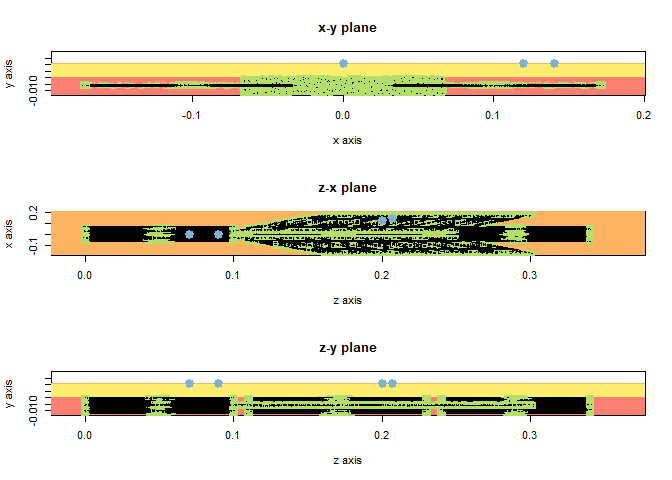<!-- -->

We can also look at the force and EMG twitches generated by a single
activation of different MUs.

``` r
plot_force_twitches(results$MUs, MUs_to_plot=c(1,11,21,31,41,50), muscle=1)
```

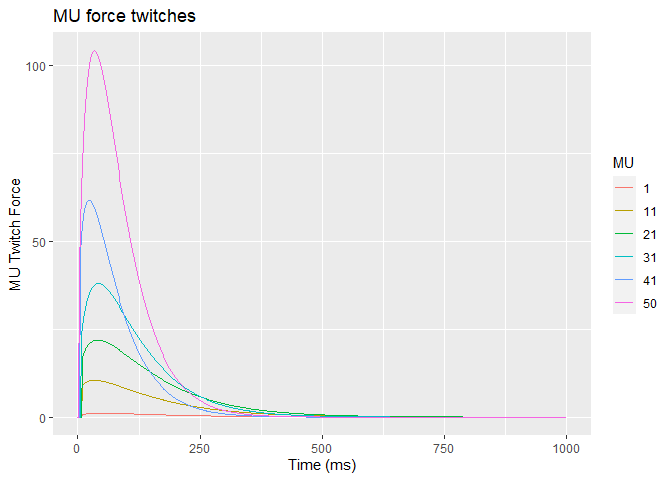<!-- -->

``` r
plot_firing_responses(results, MUs=c(1, 11, 21, 31, 41, 50), muscles=1, electrodes=1)
```

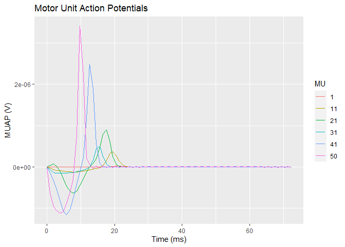<!-- -->

Various electrical and mechanical properties of the MUs are
inter-related following the *size principle*. To analyze the properties
of the MU pool, we can look at the relationship between different
properties to assess whether the distribution is realistic.

``` r
plot_electromechanical_properties(results$MUs, muscles=1)
```

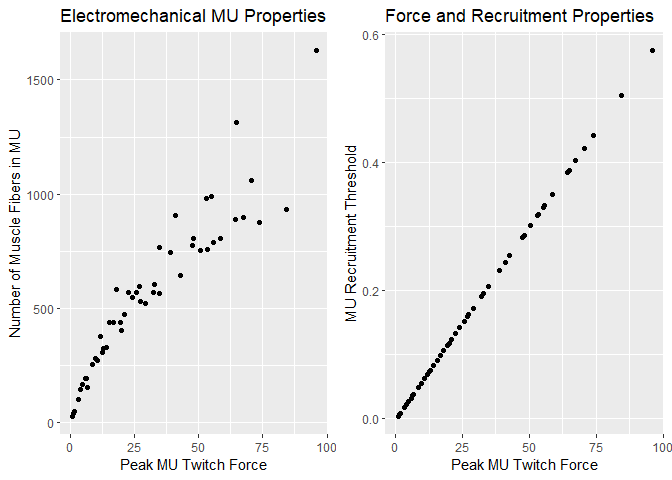<!-- -->

``` r
plot_exp_rel(results$MUs, muscle=1)
```

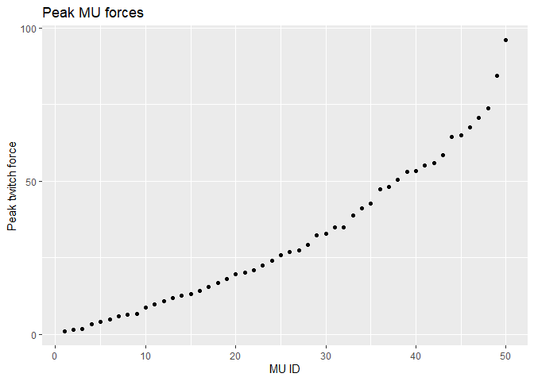<!-- -->

The activation thresholds (in terms of the generated muscle force) above
which each MU is activated, as well as the firing rates at which it
fires, can also be shown.

``` r
plot_firing_rate_funcs(results, MUs=c(1, 11, 21, 31, 41, 50), muscles=1)
```

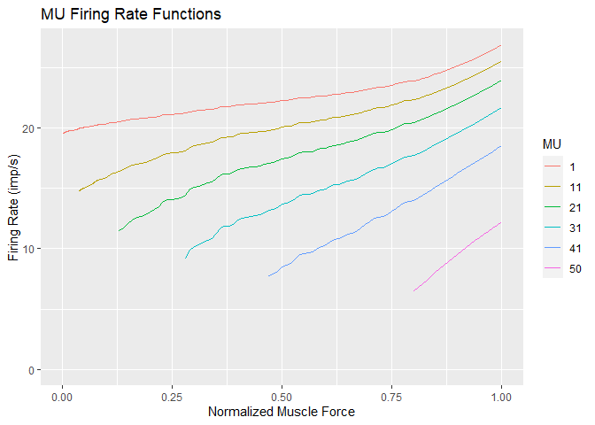<!-- -->

Overall we can see that the model generates a continuum of MUs with
different properties that range from “slow, small, weak, recruited
early” (small MU IDs in the model) to “fast, large, strong, recruited
late” (large MU IDs in the model). (Some previous authors have modeled a
small number of discrete MU *classes* or *types* instead of a continuous
distribution. We do not believe this to be accurate, cf. the discussion
and references provided in our paper.)

### Plotting simulation results

Next, let us look at the simulated force and EMG contributions of all
simulated muscles. Muscles 3 and 6 (the lowest rectus “bellies” on both
sides) do not generate strong EMG signals at either electrode pair
because of the large distance. Muscles 7 and 8 are the left and right
transversus muscles, which generate similar contributions to electrode
pair one, whereas the contribution to the second pair is of course much
more pronounced in the muscle above which the electrode pair is placed
(cf. the geometry plot above).

``` r
plot_muscle_contribs(results$muscle_contribs)
```

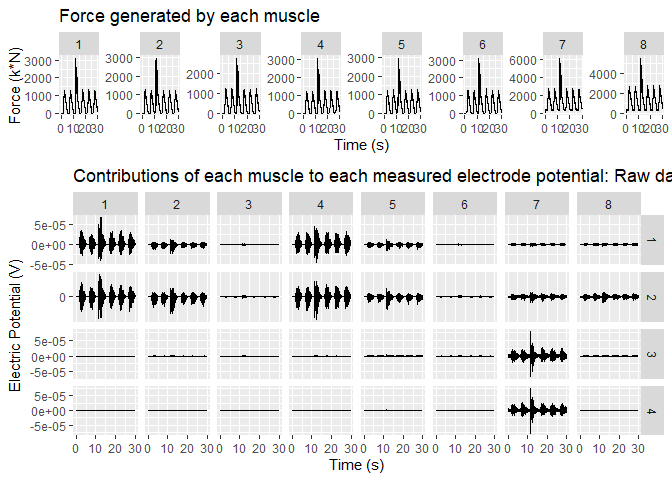<!-- -->

We can also plot the impulse trains, i.e., the instants at which
individual MUs are activated (value X means that there are X firing
events for this MU within one sampling period):

``` r
plot_impulse_trains(results, MUs=c(1, 11, 21, 31, 41, 50), tlims=c(0, 5))
```

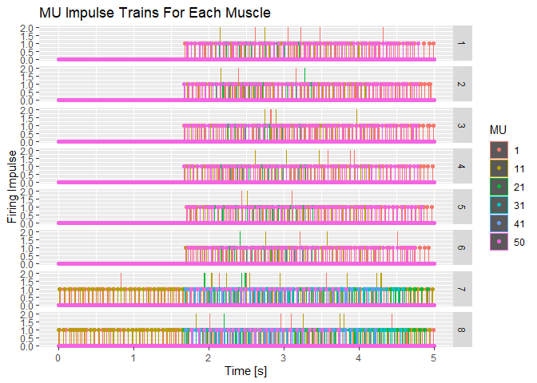<!-- -->

Moving on from the contributions of the individual muscles to
(single-)differential sEMG measurements, we can look at, e.g., the
differences of electrode pairs 1-2 and 3-4. (“electrode\_confs” is a
list of electrode weights.)

``` r
plot_surface_potentials(results$surface_potentials, electrodes=c(1,2,3,4), electrode_confs = list(c(1, -1, 0, 0), c(0, 0, 1, -1)))
```

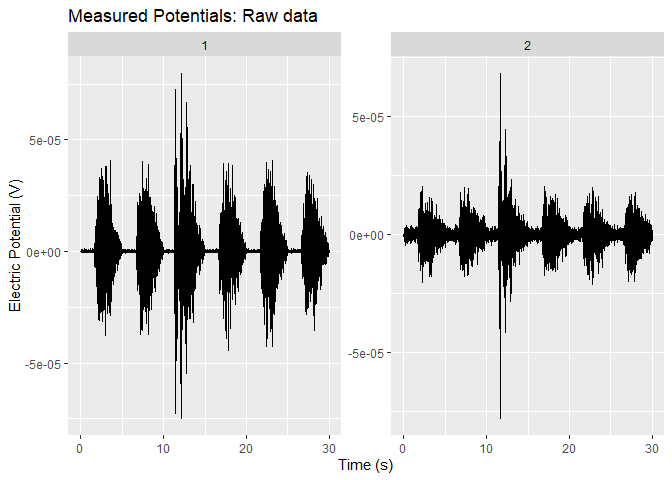<!-- -->

Using both `plot_muscle_contribs` and `plot_surface_potentials`, we can
also look at the RMS envelope, the Fourier spectrum and the amplitude
distribution of the signals (here shown only for
`plot_surface_potentials`):

``` r
plot_surface_potentials(results$surface_potentials, analysis="rms", electrodes=c(1,2,3,4), electrode_confs = list(c(1, -1, 0, 0), c(0, 0, 1, -1)))
```

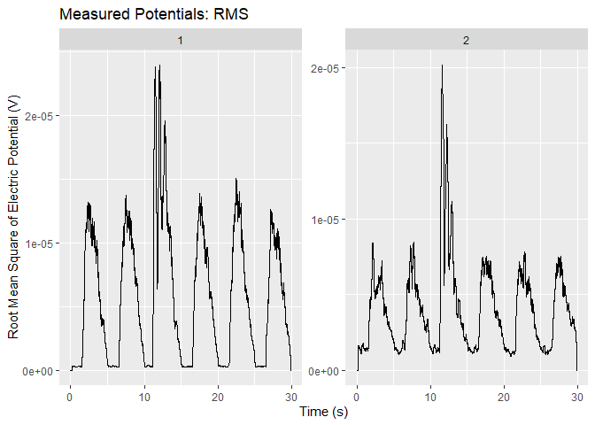<!-- -->

``` r
plot_surface_potentials(results$surface_potentials, analysis="fourier", electrodes=c(1,2,3,4), electrode_confs = list(c(1, -1, 0, 0), c(0, 0, 1, -1)))
```

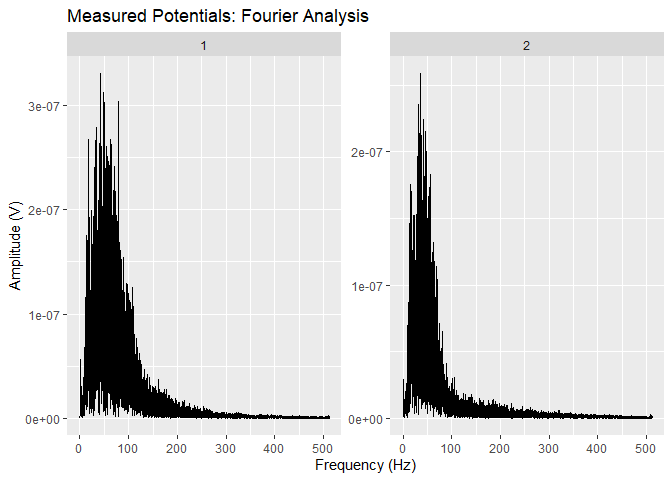<!-- -->

``` r
plot_surface_potentials(results$surface_potentials, analysis="density", electrodes=c(1,2,3,4), electrode_confs = list(c(1, -1, 0, 0), c(0, 0, 1, -1)))
```

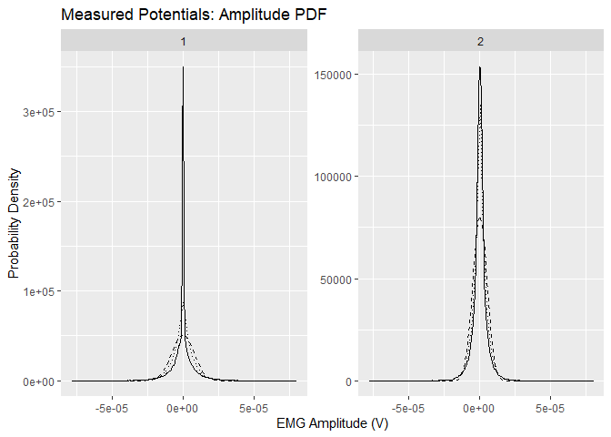<!-- -->

### Data export

The most important elements of the simulation results can be easily
exported using `export_to_mat(results, "target_file.mat")` or
`export_to_csv(results, "target_file.csv")`.

## Customization

The easiest way of running a simulation is by calling `simulate_muscle`,
as demonstrated above. This automatically performs all intermediate
steps, including: \* Constructing a muscle model object (or multiple of
them, if more than one muscle are simulated). \* Setting up the motor
unit pool of each muscle, including force generating capabilities,
action potential shapes and amplitudes, and rate coding and recruitment
properties of each MU \* Calculating the surface EMG and force twitch
responses of each MU \* Simulating the desired contraction by
calculating an impulse train of each involved MU and then obtaining the
resulting force and EMG signals as the sums of the contributions of all
individual MUs.

All of these steps can also be performed individually, however: see the
implementation of the simulate\_muscle function for details on how to
perform this (essentially by passing the muscle object through a chain
of function calls). In particular, it is possible to set up one or
multiple muscle objects using `setup_muscles` (computationally very
cheap), calculate the resulting surface EMG twitch responses using
`calculate_semg_TFs` (computationally rather expensive), and then store
the resulting muscle object for future usage. This muscle object can
then be reloaded very quickly and be used to simulate a desired muscle
force trajectory using `simulate_model` without having to re-calculate
all the muscle properties.

The computational effort required to perform a simulation roughly
depends on two factors: a) The number of muscle fiber - electrode pairs
for which transfer functions need to be computed. This obviously scales
with the product “num\_fibers \* num\_electrodes”. b) The number of time
steps to simulate.

The function `simulate_model` implements the simulation of a complete
contraction, following a prescribed muscle force activation level.
Currently, there is no easily callable method implemented for simulating
just a single time step. If this is desired, see the implementation of
the “simulate\_model” function for pointers on how this can be
implemented.

## Current Limitations

-   Effects due to peripheral fatigue are not included in the model.
-   Effects due to dynamic changes of geometry (muscle shortening &
    thickening, etc.) are not included in the model.
-   The geometrical model of Farina and Rainoldi (1999) which is
    implemented here is very limited and - depending on the particular
    muscle to be modeled - may be far from reality: fibers are following
    straight lines parallel to a planar skin surface, and they do not
    deform during contractions. For limb muscles, Farina et al. have
    later derived a circular volume conduction model that could be
    easily plugged into the simulator if someone would be willing to
    implement it.
-   Physiological force control is neither modeled nor simulated. The
    model simply describes the muscle’s response to an input activation
    signal that corresponds to a particular output force level. For
    simulating responses to rapid stimuli or target tracking, a force
    controller model should be used to control the input to the
    simulation model.
-   Measurement noise is not included in the simulated data, but can
    obviously easily be added to the resulting signals.
-   (For the included simulation of respiratory mechanics: many of the
    physiological parameters are not known in the literature and have
    been estimated rather crudely. Note also that for this application,
    the assumed geometrical model is definitely quite far from reality.)

The code is reasonably modular, and modifications or improvements of
individual model components can likely be implemented and integrated
with the rest of the simulator with reasonable effort.

------------------------------------------------------------------------

Eike Petersen, Institute for Electrical Enginnering in Medicine (IME),
Universität zu Lübeck. 2015-2021. Contributions by Marcus Eger,
Drägerwerk AG & Co KGaA.
